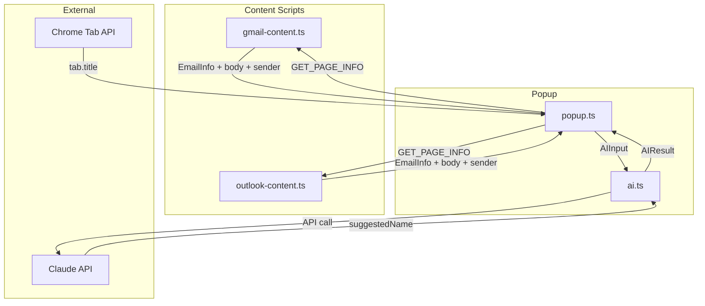
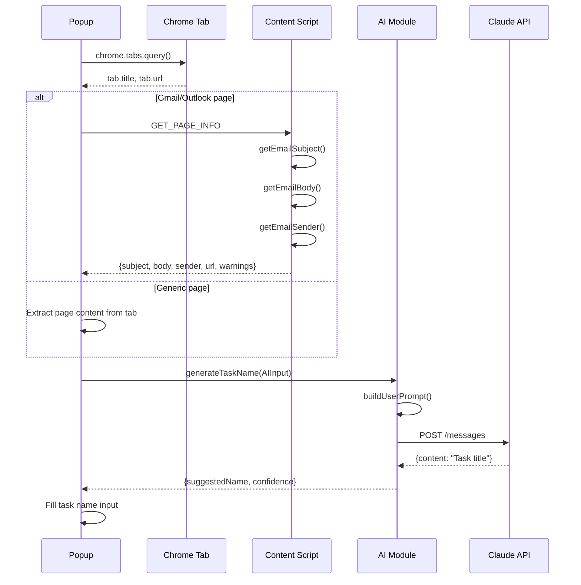

# Design: AI Task Title Enhancement

## Overview

Extend existing content scripts to extract email body, sender, and page content. Fix pageTitle bug in popup. Update AI module with richer context and improved action-oriented prompt.

## Architecture



## Data Flow



## Components

### Gmail Content Script (`gmail-content.ts`)

**New Functions:**

| Function | Purpose | Returns |
|----------|---------|---------|
| `getEmailBody()` | Extract email body text from DOM | `string \| undefined` |
| `getEmailSender()` | Extract sender name/email from DOM | `string \| undefined` |

**DOM Selectors for Body:**
```typescript
const bodySelectors = [
  '.a3s.aiL',           // Main email body class
  '[data-message-id] .ii.gt', // Alternative body container
  '.adn.ads',           // Email content wrapper
];
```

**DOM Selectors for Sender:**
```typescript
const senderSelectors = [
  'span.gD',            // Sender email element
  '[email]',            // Element with email attribute
  'span[data-hovercard-id]', // Hoverable sender name
];
```

### Outlook Content Script (`outlook-content.ts`)

**New Functions:**

| Function | Purpose | Returns |
|----------|---------|---------|
| `getEmailBody()` | Extract email body text from DOM | `string \| undefined` |

**DOM Selectors for Body:**
```typescript
const bodySelectors = [
  '[data-app-section="ConversationReadingPane"]',
  '.XbIp4.jmmB7.GNqVo',  // Reading pane body
  '[aria-label="Message body"]',
];
```

**Sender:** Already has `getSenderInfo()` - enhance with fallback selectors.

### Types (`types.ts`)

**Extended AIInput:**
```typescript
export interface AIInput {
  // Existing
  pageTitle?: string;
  selectedText?: string;
  emailSubject?: string;
  pageUrl?: string;
  // New fields
  emailBody?: string;         // Truncated to 1000 chars
  emailSender?: string;       // Sender name or email
  pageContent?: string;       // For non-email pages, up to 2000 chars
  contentType?: 'email' | 'webpage';  // Helps prompt strategy
}
```

**Extended GmailEmailInfo:**
```typescript
export interface GmailEmailInfo {
  // Existing fields...
  emailBody?: string;    // NEW
  emailSender?: string;  // NEW
}
```

**Extended OutlookEmailInfo:**
```typescript
export interface OutlookEmailInfo {
  // Existing fields...
  subject?: string;      // NEW (currently only in getEmailSubject return)
  emailBody?: string;    // NEW
  emailSender?: string;  // NEW
}
```

### Popup (`popup.ts`)

**Changes:**

| Change | Description |
|--------|-------------|
| Fix pageTitle | Use `tab.title` instead of `document.title` |
| Pass emailBody | Add to AIInput from content script response |
| Pass emailSender | Add to AIInput from content script response |
| Pass pageContent | For non-email pages, extract visible text |
| Add contentType | Set based on page URL detection |

**Updated `requestPageInfo()`:**
```typescript
// After getting tab
const pageTitle = tab.title || ''; // FIX: Use tab.title

// After content script response
if (isGmailPage(currentUrl)) {
  const gmailInfo = response as GmailEmailInfo;
  state.emailBody = gmailInfo.emailBody;
  state.emailSender = gmailInfo.emailSender;
  state.contentType = 'email';
} else if (isOutlookPage(currentUrl)) {
  // Similar for Outlook
} else {
  state.contentType = 'webpage';
  state.pageContent = await extractPageContent(tab.id);
}
```

**New Helper:**
```typescript
async function extractPageContent(tabId: number): Promise<string | undefined> {
  // Execute script to get document.body.innerText
  // Truncate to 2000 chars
}
```

### AI Module (`ai.ts`)

**Improved System Prompt:**
```typescript
const SYSTEM_PROMPT = `You extract actionable task titles from emails and web pages.

Rules:
- Start with action verb (Review, Follow up, Schedule, Reply to, Complete, etc.)
- Include key entity (person name, document, project, deadline)
- 5-10 words maximum
- Preserve specific details (dates, numbers, names)
- Output ONLY the task title, no explanation

Examples:
- Email about budget review -> "Review Q4 budget before Thursday meeting"
- Invoice approval request -> "Approve invoice #4521 for John"
- PR review notification -> "Review PR #123 - authentication fix"`;
```

**Updated `buildUserPrompt()`:**
```typescript
function buildUserPrompt(input: AIInput): string {
  const parts: string[] = [];

  // Priority order: selectedText > emailSubject > emailBody > pageContent

  if (input.selectedText) {
    const truncated = truncate(input.selectedText, 500);
    parts.push(`Selected text (primary): ${truncated}`);
  }

  if (input.emailSubject) {
    parts.push(`Email subject: ${input.emailSubject}`);
  }

  if (input.emailSender) {
    parts.push(`From: ${input.emailSender}`);
  }

  if (input.emailBody) {
    const truncated = truncate(input.emailBody, 1000);
    parts.push(`Email content: ${truncated}`);
  }

  if (input.pageTitle && input.pageTitle !== input.emailSubject) {
    const truncated = truncate(input.pageTitle, 100);
    parts.push(`Page title: ${truncated}`);
  }

  if (input.pageContent && input.contentType === 'webpage') {
    const truncated = truncate(input.pageContent, 2000);
    parts.push(`Page content: ${truncated}`);
  }

  if (input.pageUrl) {
    parts.push(`URL: ${input.pageUrl}`);
  }

  if (parts.length === 0) {
    return 'Create a generic task title.';
  }

  return `Generate a task title from this context:\n\n${parts.join('\n')}`;
}
```

## Technical Decisions

| Decision | Options Considered | Choice | Rationale |
|----------|-------------------|--------|-----------|
| Email body truncation | 500, 1000, 2000 chars | 1000 | Balance context quality vs token cost |
| Page content truncation | 1000, 2000, 5000 chars | 2000 | Web pages need more context than emails |
| Selected text priority | Equal weight, Primary | Primary | User intent signal is strongest |
| Page content extraction | Content script, executeScript | executeScript | Avoids new content script for all pages |
| Sender extraction | Name only, Email only, Both | Both | Name preferred, email as fallback |
| Prompt structure | Plain text, XML tags | Plain text | Simpler, Haiku handles well |

## File Structure

| File | Action | Purpose |
|------|--------|---------|
| `src/content/gmail-content.ts` | Modify | Add `getEmailBody()`, `getEmailSender()`, update message response |
| `src/content/outlook-content.ts` | Modify | Add `getEmailBody()`, enhance sender extraction, update message response |
| `src/shared/types.ts` | Modify | Extend `AIInput`, `GmailEmailInfo`, `OutlookEmailInfo` |
| `src/popup/popup.ts` | Modify | Fix pageTitle bug, pass new data to AI, add page content extraction |
| `src/shared/ai.ts` | Modify | Update `SYSTEM_PROMPT`, enhance `buildUserPrompt()` |

## Error Handling

| Error Scenario | Handling Strategy | User Impact |
|----------------|-------------------|-------------|
| Email body selector fails | Return undefined, log warning | Falls back to subject-only |
| Email sender selector fails | Return undefined, skip sender in prompt | Title lacks "Reply to X" context |
| Page content extraction fails | Return undefined, use pageTitle only | Less context for AI |
| Content script not loaded | Use tab.title and tab.url only | Basic title suggestion still works |
| Confidential mode email | Warn user, attempt extraction anyway | May get partial content |
| Empty email body | Use subject only | Normal subject-based title |
| Very long content | Truncate at char limits | Context preserved, tokens controlled |

## Edge Cases

| Case | Handling |
|------|----------|
| Email in compose mode | No body to extract; use draft subject if available |
| Forwarded email with quotes | Extract all visible text; AI filters noise |
| Multi-email thread view | Extract from focused/expanded email only |
| Empty subject line | Use email body or sender for title |
| Non-English content | Pass to AI as-is; model handles multilingual |
| Page with minimal text | Use URL and page title; lower confidence |
| Popup opened via context menu | Check `contextMenuData` storage for selectedText |

## Test Strategy

### Unit Tests

**gmail-content.test.ts:**
- `getEmailBody()` returns body text from mock DOM
- `getEmailBody()` returns undefined when selectors fail
- `getEmailBody()` truncates at 1000 chars
- `getEmailSender()` extracts sender name
- `getEmailSender()` falls back to email address

**outlook-content.test.ts:**
- `getEmailBody()` returns body text from mock DOM
- `getEmailBody()` handles all 3 variants (personal, business, office365)
- `getSenderInfo()` extracts sender with enhanced selectors

**ai.test.ts:**
- `buildUserPrompt()` prioritizes selectedText
- `buildUserPrompt()` includes emailBody when present
- `buildUserPrompt()` includes emailSender when present
- `buildUserPrompt()` includes pageContent for webpage type
- `buildUserPrompt()` truncates all fields correctly
- System prompt produces action-verb titles (integration test)

**popup.test.ts (if added):**
- pageTitle comes from tab.title, not document.title
- AIInput populated with all available context
- Graceful handling when content script unavailable

### Integration Tests

| Test | Setup | Expected |
|------|-------|----------|
| Gmail email -> task title | Mock Gmail DOM with body | Title reflects email content |
| Outlook email -> task title | Mock Outlook DOM with body | Title reflects email content |
| Web page -> task title | Mock generic page | Title reflects page content |
| Offline mode | Simulate offline | AI skipped, form still works |

### E2E Tests (Manual)

1. Open Gmail email -> Click extension -> Title includes email context
2. Open Outlook email -> Click extension -> Title includes email context
3. Open generic web page -> Click extension -> Title reflects page
4. Select text on page -> Click extension -> Title uses selected text
5. Confidential email -> Click extension -> Warning shown, extraction attempted

## Performance Considerations

| Aspect | Approach |
|--------|----------|
| DOM extraction | Single-pass selector checking, no repeated queries |
| Content truncation | Done in content script before message passing |
| Token budget | Max ~2000 tokens input; Haiku handles in <2s |
| Parallel loading | Page info fetched while auth checked |
| Caching | None needed; context changes per page |

## Security Considerations

| Concern | Mitigation |
|---------|------------|
| Email content privacy | Content used only for API call, not stored |
| PII in titles | AI instructed to preserve names (user's intent) |
| API key exposure | Key stored in chrome.storage.local only |
| Cross-origin access | Content scripts run in page context, sandboxed |

## Existing Patterns to Follow

Based on codebase analysis:

| Pattern | Location | Apply To |
|---------|----------|----------|
| DOM selector chaining with fallbacks | `gmail-content.ts:getEmailSubject()` | New `getEmailBody()`, `getEmailSender()` |
| Truncation with ellipsis | `ai.ts:buildUserPrompt()` | All new content fields |
| Console logging for debug | `gmail-content.ts:console.debug()` | New extraction functions |
| Async message handling | `gmail-content.ts:chrome.runtime.onMessage` | Include new fields in response |
| Type extensions | `types.ts` | Add new optional fields to existing interfaces |
| Graceful null returns | `gmail-content.ts:detectAccountEmail()` | All new extraction functions |

## Implementation Steps

1. Extend `AIInput` and email info types in `types.ts`
2. Add `getEmailBody()` to `gmail-content.ts` with DOM selectors
3. Add `getEmailSender()` to `gmail-content.ts` with DOM selectors
4. Update Gmail message listener to include new fields
5. Add `getEmailBody()` to `outlook-content.ts` with DOM selectors
6. Enhance `getSenderInfo()` in `outlook-content.ts`
7. Update Outlook message listener to include new fields
8. Fix `popup.ts` to use `tab.title` instead of `document.title`
9. Add page content extraction helper to `popup.ts`
10. Update `popup.ts` to pass all new fields to AI
11. Improve `SYSTEM_PROMPT` in `ai.ts`
12. Update `buildUserPrompt()` in `ai.ts` with priority logic
13. Add unit tests for new extraction functions
14. Add integration test for full flow
15. Run local CI: `pnpm lint && pnpm check-types && pnpm test && pnpm build`
