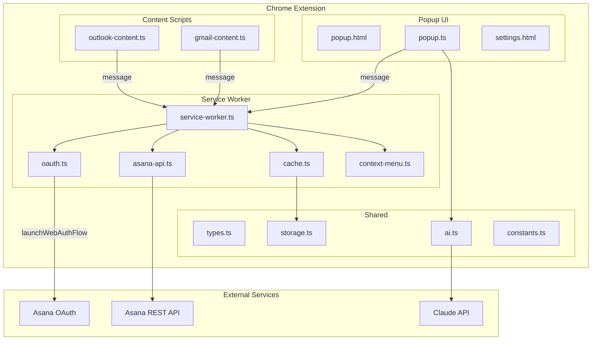
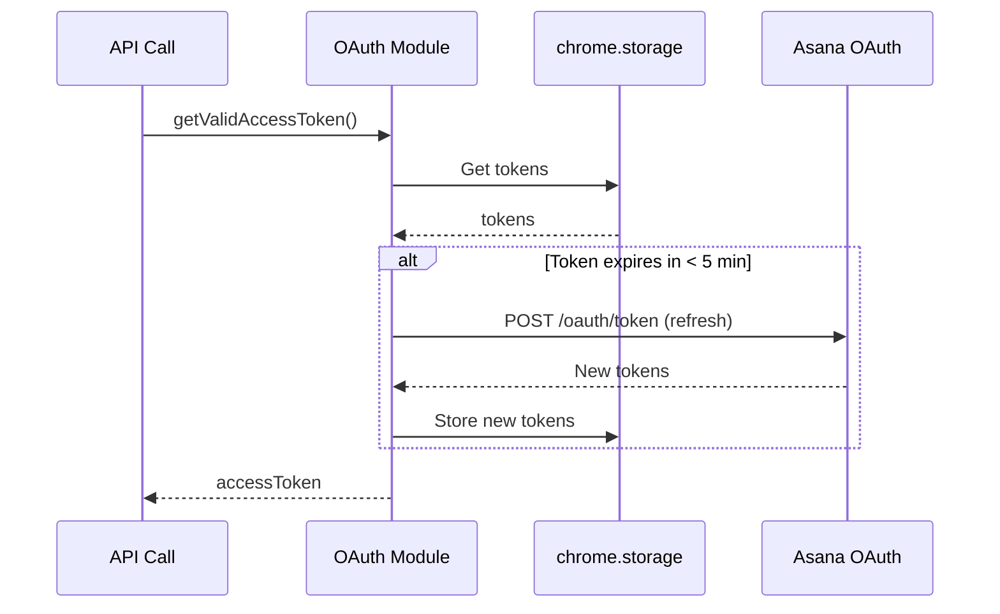
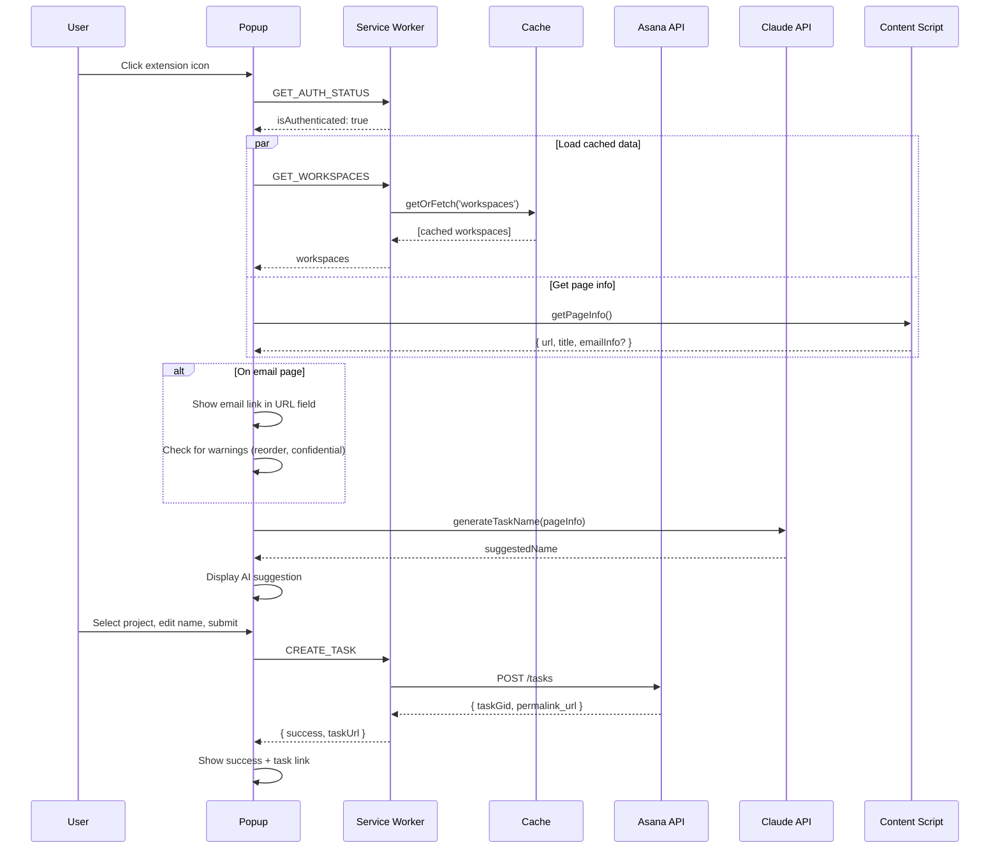

# Design: Asana Chrome Extension

## Overview

Chrome Extension (Manifest V3) for creating Asana tasks from any web page. Uses service worker for background processing (OAuth, API calls), content scripts for Gmail/Outlook email link extraction, and popup UI for task creation. Caches Asana data in `chrome.storage.local` with stale-while-revalidate pattern.

## Architecture



## Components

### Service Worker (background/service-worker.ts)

**Purpose**: Central hub for extension logic, message routing, OAuth, API calls

**Responsibilities**:

- Handle messages from popup and content scripts
- Manage OAuth token lifecycle (storage, refresh)
- Execute Asana API calls
- Manage context menu
- Coordinate cache operations

**Interfaces**:

```typescript
// Message types from popup/content scripts
type ExtensionMessage =
  | { type: "GET_PAGE_INFO" }
  | { type: "CREATE_TASK"; payload: CreateTaskPayload }
  | { type: "GET_WORKSPACES" }
  | { type: "GET_PROJECTS"; workspaceGid: string }
  | { type: "GET_SECTIONS"; projectGid: string }
  | { type: "GET_TAGS"; workspaceGid: string }
  | { type: "REFRESH_CACHE" }
  | { type: "GET_AUTH_STATUS" }
  | { type: "START_AUTH" }
  | { type: "LOGOUT" };

interface CreateTaskPayload {
  name: string;
  notes?: string;
  projectGid: string;
  sectionGid?: string;
  tagGids?: string[];
  workspaceGid: string;
}

interface CreateTaskResponse {
  success: boolean;
  taskGid?: string;
  taskUrl?: string;
  error?: string;
}
```

### OAuth Module (background/oauth.ts)

**Purpose**: Handle Asana OAuth2 with PKCE flow

**Responsibilities**:

- Generate PKCE code verifier/challenge
- Launch auth flow via `chrome.identity.launchWebAuthFlow`
- Exchange auth code for tokens
- Store tokens securely
- Auto-refresh before expiration

**Interfaces**:

```typescript
interface OAuthTokens {
  accessToken: string;
  refreshToken: string;
  expiresAt: number; // Unix timestamp
}

interface OAuthConfig {
  clientId: string;
  redirectUrl: string; // from chrome.identity.getRedirectURL()
  scopes: string[];
}

// Functions
function startAuthFlow(): Promise<OAuthTokens>;
function refreshTokens(): Promise<OAuthTokens>;
function getValidAccessToken(): Promise<string>; // Auto-refreshes if needed
function logout(): Promise<void>;
function isAuthenticated(): Promise<boolean>;
```

**Token Refresh Strategy**:



### Asana API Module (background/asana-api.ts)

**Purpose**: Wrapper for Asana REST API with caching

**Responsibilities**:

- Execute API calls with auth header
- Handle rate limiting (429) with exponential backoff
- Return data with cache integration

**Interfaces**:

```typescript
interface AsanaWorkspace {
  gid: string;
  name: string;
}

interface AsanaProject {
  gid: string;
  name: string;
  workspaceGid: string;
}

interface AsanaSection {
  gid: string;
  name: string;
}

interface AsanaTag {
  gid: string;
  name: string;
  workspaceGid: string;
}

interface AsanaTask {
  gid: string;
  name: string;
  permalink_url: string;
}

// API Functions
function getWorkspaces(): Promise<AsanaWorkspace[]>;
function getProjects(workspaceGid: string): Promise<AsanaProject[]>;
function getSections(projectGid: string): Promise<AsanaSection[]>;
function getTags(workspaceGid: string): Promise<AsanaTag[]>;
function createTask(payload: CreateTaskPayload): Promise<AsanaTask>;
```

### Cache Module (background/cache.ts)

**Purpose**: Stale-while-revalidate caching with TTL

**Responsibilities**:

- Store/retrieve cached data with TTL
- Background refresh for stale data
- Manual cache invalidation

**Interfaces**:

```typescript
interface CacheEntry<T> {
  data: T;
  timestamp: number;
  ttl: number; // milliseconds
}

interface CacheConfig {
  defaultTTL: number; // Default: 5 minutes
}

// Functions
function getCached<T>(key: string): Promise<T | null>;
function setCached<T>(key: string, data: T, ttl?: number): Promise<void>;
function getOrFetch<T>(
  key: string,
  fetchFn: () => Promise<T>,
  options?: { forceRefresh?: boolean; backgroundRefresh?: boolean },
): Promise<T>;
function clearCache(): Promise<void>;
function getCacheStats(): Promise<{ keys: string[]; totalSize: number }>;
```

**Cache Keys**:
| Key Pattern | Data | TTL |
|-------------|------|-----|
| `workspaces` | User workspaces | 5 min |
| `projects:{workspaceGid}` | Projects in workspace | 5 min |
| `sections:{projectGid}` | Sections in project | 5 min |
| `tags:{workspaceGid}` | Tags in workspace | 5 min |
| `lastUsed` | Last selections | No TTL |
| `emailMapping:{domain}` | Email to userId map | 1 hour |

### Gmail Content Script (content/gmail-content.ts)

**Purpose**: Extract email messageId and account info from Gmail

**Responsibilities**:

- Detect Gmail page
- Parse messageId from URL hash
- Detect current account email address
- Build permanent email link
- Detect confidential mode

**Interfaces**:

```typescript
interface GmailEmailInfo {
  messageId: string | null;
  userId: string; // e.g., "0", "1"
  accountEmail: string | null;
  permanentUrl: string;
  isConfidentialMode: boolean;
  subject?: string;
}

// Message to service worker
interface GmailPageInfo {
  type: "GMAIL_PAGE_INFO";
  payload: GmailEmailInfo;
}
```

**URL Parsing Logic**:

```typescript
// URL: https://mail.google.com/mail/u/0/#inbox/FMfcgzQXJWDKljhBnBvRJrpZvTdvpTxl
function parseGmailUrl(url: string): GmailEmailInfo {
  const urlObj = new URL(url);

  // Extract userId from path: /mail/u/{userId}/
  const pathMatch = urlObj.pathname.match(/\/mail\/u\/(\d+)/);
  const userId = pathMatch ? pathMatch[1] : "0";

  // Extract messageId from hash: #inbox/{messageId} or #all/{messageId}
  const hash = urlObj.hash;
  const hashMatch = hash.match(
    /#(?:inbox|all|sent|drafts|search\/[^/]+)\/([A-Za-z0-9_-]+)/,
  );
  const messageId = hashMatch ? hashMatch[1] : null;

  // Build permanent URL using #all/ for stability
  const permanentUrl = messageId
    ? `https://mail.google.com/mail/u/${userId}/#all/${messageId}`
    : url;

  return { messageId, userId, permanentUrl /* ... */ };
}
```

### Outlook Content Script (content/outlook-content.ts)

**Purpose**: Extract email ItemID from Outlook variants

**Responsibilities**:

- Detect Outlook variant (live.com, office.com, office365.com)
- Parse ItemID from URL path
- Build permanent deep link

**Interfaces**:

```typescript
type OutlookVariant = "personal" | "business" | "office365";

interface OutlookEmailInfo {
  itemId: string | null;
  variant: OutlookVariant;
  permanentUrl: string;
}

// Message to service worker
interface OutlookPageInfo {
  type: "OUTLOOK_PAGE_INFO";
  payload: OutlookEmailInfo;
}
```

**URL Parsing Logic**:

```typescript
// Personal: https://outlook.live.com/mail/0/inbox/id/{ItemID}
// Business: https://outlook.office.com/mail/inbox/id/{ItemID}
// Office 365: https://outlook.office365.com/mail/inbox/id/{ItemID}

function parseOutlookUrl(url: string): OutlookEmailInfo {
  const urlObj = new URL(url);
  const hostname = urlObj.hostname;

  // Determine variant
  const variant: OutlookVariant = hostname.includes("live.com")
    ? "personal"
    : hostname.includes("office365.com")
      ? "office365"
      : "business";

  // Extract ItemID from path after /id/
  const pathParts = urlObj.pathname.split("/id/");
  const itemId =
    pathParts.length > 1
      ? decodeURIComponent(pathParts[1].split("/")[0])
      : null;

  // Build permanent deep link
  const permanentUrl = itemId
    ? `https://outlook.office365.com/owa/?ItemID=${encodeURIComponent(itemId)}&exvsurl=1&viewmodel=ReadMessageItem`
    : url;

  return { itemId, variant, permanentUrl };
}
```

### AI Module (shared/ai.ts)

**Purpose**: Generate task name suggestions via Claude API

**Responsibilities**:

- Call Claude API with page context
- Handle cancellation
- Manage API errors gracefully

**Interfaces**:

```typescript
interface AIConfig {
  apiKey: string;
  model: string; // Default: claude-haiku-4-5
}

interface AIInput {
  pageTitle?: string;
  selectedText?: string;
  emailSubject?: string;
  pageUrl?: string;
}

interface AIResult {
  suggestedName: string;
  confidence?: "high" | "medium" | "low";
}

// Functions
function generateTaskName(
  input: AIInput,
  config: AIConfig,
  signal?: AbortSignal,
): Promise<AIResult>;

function isApiKeyValid(apiKey: string): Promise<boolean>;
```

**Claude API Call**:

```typescript
const SYSTEM_PROMPT = `Generate a concise, actionable task title (5-10 words).
Output ONLY the task title, no explanation.
Examples:
- "Review Q4 budget proposal"
- "Reply to John about project timeline"
- "Schedule meeting with design team"`;

async function generateTaskName(
  input: AIInput,
  config: AIConfig,
  signal?: AbortSignal,
): Promise<AIResult> {
  const userPrompt = buildUserPrompt(input);

  const response = await fetch("https://api.anthropic.com/v1/messages", {
    method: "POST",
    headers: {
      "Content-Type": "application/json",
      "x-api-key": config.apiKey,
      "anthropic-version": "2023-06-01",
      "anthropic-dangerous-direct-browser-access": "true",
    },
    body: JSON.stringify({
      model: config.model,
      max_tokens: 50,
      messages: [{ role: "user", content: userPrompt }],
      system: SYSTEM_PROMPT,
    }),
    signal,
  });

  // ... handle response
}
```

### Popup UI (popup/popup.ts)

**Purpose**: Task creation form UI

**Responsibilities**:

- Display cached data immediately
- Handle user input
- Trigger AI suggestion on open
- Submit task creation
- Show success/error states

**State**:

```typescript
interface PopupState {
  // Auth
  isAuthenticated: boolean;

  // Data (from cache)
  workspaces: AsanaWorkspace[];
  projects: AsanaProject[];
  sections: AsanaSection[];
  tags: AsanaTag[];

  // Selections
  selectedWorkspaceGid: string | null;
  selectedProjectGid: string | null;
  selectedSectionGid: string | null;
  selectedTagGids: string[];

  // Task fields
  taskName: string;
  taskNotes: string;
  pageUrl: string;

  // AI
  aiStatus: "idle" | "loading" | "done" | "error" | "cancelled";
  aiSuggestion: string | null;

  // Page info
  pageInfo: PageInfo | null;

  // Warnings
  warnings: Warning[];

  // Submit status
  submitStatus: "idle" | "submitting" | "success" | "error";
  createdTaskUrl: string | null;
}

interface Warning {
  type: "gmail_account_reorder" | "gmail_confidential";
  message: string;
}
```

## Data Flow



## Technical Decisions

| Decision         | Options Considered                       | Choice                   | Rationale                                 |
| ---------------- | ---------------------------------------- | ------------------------ | ----------------------------------------- |
| Build tool       | Webpack, esbuild, Vite                   | **esbuild**              | Fast, simple config, good for extensions  |
| Language         | JavaScript, TypeScript                   | **TypeScript**           | Type safety, better IDE support           |
| UI framework     | React, Vue, Vanilla                      | **Vanilla TS**           | No build complexity, small bundle, fast   |
| Storage          | localStorage, chrome.storage             | **chrome.storage.local** | Required for MV3 service workers          |
| OAuth            | Asana SDK, manual                        | **Manual**               | SDK OAuth doesn't work in browser context |
| AI model         | Claude Haiku, Claude Sonnet, GPT-4o-mini | **Claude Haiku**         | Fast, cheap, sufficient for task names    |
| Gmail extraction | gmail.js, URL parsing                    | **URL parsing**          | No jQuery dependency, more reliable       |
| Testing          | Jest, Vitest                             | **Vitest**               | Fast, ESM native, good TS support         |

## File Structure

| File                               | Action | Purpose                        |
| ---------------------------------- | ------ | ------------------------------ |
| `manifest.json`                    | Create | Extension manifest (MV3)       |
| `src/background/service-worker.ts` | Create | Main background script         |
| `src/background/oauth.ts`          | Create | OAuth2 + PKCE flow             |
| `src/background/asana-api.ts`      | Create | Asana API wrapper              |
| `src/background/cache.ts`          | Create | Stale-while-revalidate cache   |
| `src/background/context-menu.ts`   | Create | Right-click menu handler       |
| `src/content/gmail-content.ts`     | Create | Gmail email extraction         |
| `src/content/outlook-content.ts`   | Create | Outlook email extraction       |
| `src/popup/popup.html`             | Create | Popup UI markup                |
| `src/popup/popup.ts`               | Create | Popup UI logic                 |
| `src/popup/popup.css`              | Create | Popup styles                   |
| `src/settings/settings.html`       | Create | Settings page markup           |
| `src/settings/settings.ts`         | Create | Settings page logic            |
| `src/shared/types.ts`              | Create | Shared TypeScript interfaces   |
| `src/shared/storage.ts`            | Create | Storage utilities              |
| `src/shared/ai.ts`                 | Create | Claude API integration         |
| `src/shared/constants.ts`          | Create | Shared constants               |
| `package.json`                     | Create | Dependencies and scripts       |
| `tsconfig.json`                    | Create | TypeScript config              |
| `esbuild.config.js`                | Create | Build configuration            |
| `.env.example`                     | Create | Environment variables template |

## Error Handling

| Error Scenario            | Handling Strategy                               | User Impact                                       |
| ------------------------- | ----------------------------------------------- | ------------------------------------------------- |
| OAuth failure             | Show error, retry button                        | "Authentication failed. Please try again."        |
| Token expired during call | Auto-refresh, retry once                        | Transparent to user                               |
| Asana 429 rate limit      | Exponential backoff (1s, 2s, 4s, max 3 retries) | Brief delay, then success or error                |
| Asana API error           | Show error message from API                     | "Failed to create task: [error]"                  |
| AI API error              | Show error, allow manual entry                  | "AI suggestion unavailable. Enter name manually." |
| AI timeout (>5s)          | Auto-cancel, allow manual                       | AI field returns to editable state                |
| Network offline           | Detect, disable submit                          | "You appear to be offline."                       |
| Gmail messageId not found | Fall back to current URL                        | URL field shows current page URL                  |
| Outlook ItemID not found  | Fall back to current URL                        | URL field shows current page URL                  |
| Cache miss                | Show loading, fetch fresh                       | Brief spinner, then data                          |
| Invalid API key           | Show settings link                              | "Invalid Claude API key. Check settings."         |

## Edge Cases

- **Gmail account reorder**: Cache email-to-userId mapping. On popup open, if cached email differs from current, show warning: "Gmail account order may have changed. Verify the link works."
- **Gmail confidential mode**: Detect via DOM (look for confidential mode UI elements). Show warning: "This email is in confidential mode. Link may not work for others."
- **Multiple Asana workspaces**: Show workspace selector, remember last-used
- **No projects in workspace**: Show message "No projects found. Create one in Asana."
- **Very long page titles**: Truncate to 100 chars for AI input
- **Selected text spans multiple elements**: Join with spaces, limit to 500 chars
- **User cancels AI mid-generation**: AbortController cancels fetch, clear suggestion field
- **Popup opened on restricted page** (chrome://): Show error "Cannot create task from this page"
- **Token refresh fails**: Clear tokens, prompt re-auth
- **Large tag list (>100)**: Implement search/filter, paginate API calls

## Test Strategy

### Unit Tests

| Component            | Test Focus                               | Mocks                               |
| -------------------- | ---------------------------------------- | ----------------------------------- |
| `oauth.ts`           | PKCE generation, token refresh logic     | `chrome.identity`, `chrome.storage` |
| `cache.ts`           | TTL expiration, stale-while-revalidate   | `chrome.storage`                    |
| `gmail-content.ts`   | URL parsing (all view types)             | None (pure functions)               |
| `outlook-content.ts` | URL parsing (all 3 variants)             | None (pure functions)               |
| `ai.ts`              | API call formatting, error handling      | `fetch`                             |
| `asana-api.ts`       | API call formatting, rate limit handling | `fetch`                             |

### Integration Tests

| Integration Point  | Test                                 |
| ------------------ | ------------------------------------ |
| OAuth flow         | End-to-end auth with mock Asana      |
| Task creation      | Popup -> Service Worker -> Asana API |
| Cache invalidation | Manual refresh updates UI            |

### E2E Tests (Manual via Claude Browser Extension)

| User Flow                | Steps                                                               |
| ------------------------ | ------------------------------------------------------------------- |
| First-time auth          | Install -> click icon -> complete OAuth                             |
| Create task from Gmail   | Open Gmail email -> right-click -> create task -> verify link works |
| Create task from Outlook | Open Outlook email -> click icon -> create task                     |
| AI suggestion            | Open popup -> wait for AI -> accept/modify -> submit                |
| Multi-workspace          | Switch workspace -> verify projects update                          |

## Performance Considerations

| Concern                   | Mitigation                                |
| ------------------------- | ----------------------------------------- |
| Popup load time           | Cache-first strategy, parallel data fetch |
| AI latency                | Auto-trigger on open, show loading state  |
| Large workspace data      | Paginate API calls, lazy-load sections    |
| Service worker cold start | Minimal startup code, lazy-load modules   |
| Storage size              | Limit cache TTL, prune old entries        |

**Target Metrics**:

- Popup interactive: <200ms (from cache)
- Task creation: <2s
- AI suggestion: <3s

## Security Considerations

| Concern                  | Mitigation                                           |
| ------------------------ | ---------------------------------------------------- |
| Token storage            | `chrome.storage.local` (encrypted at rest by Chrome) |
| API key storage          | Same as tokens, never sent to Asana                  |
| XSS in popup             | No innerHTML with user data, sanitize inputs         |
| Content script isolation | Minimal permissions, only read URLs                  |
| PKCE                     | Required for OAuth security                          |

## Existing Patterns to Follow

Based on research (no existing codebase):

- Use `chrome.runtime.sendMessage` for popup <-> service worker communication
- Use `chrome.tabs.sendMessage` for service worker <-> content script
- Follow Asana's official extension example structure (modernized for MV3)
- Use `chrome.identity.launchWebAuthFlow` for third-party OAuth (not `getAuthToken`)

## Manifest V3 Configuration

```json
{
  "manifest_version": 3,
  "name": "Asana Task Creator",
  "version": "1.0.0",
  "description": "Create Asana tasks from any web page with AI-powered suggestions",
  "permissions": ["identity", "storage", "contextMenus", "activeTab"],
  "host_permissions": [
    "https://app.asana.com/*",
    "https://api.anthropic.com/*"
  ],
  "background": {
    "service_worker": "background/service-worker.js",
    "type": "module"
  },
  "content_scripts": [
    {
      "matches": ["https://mail.google.com/*"],
      "js": ["content/gmail-content.js"],
      "run_at": "document_idle"
    },
    {
      "matches": [
        "https://outlook.live.com/*",
        "https://outlook.office.com/*",
        "https://outlook.office365.com/*"
      ],
      "js": ["content/outlook-content.js"],
      "run_at": "document_idle"
    }
  ],
  "action": {
    "default_popup": "popup/popup.html",
    "default_icon": {
      "16": "icons/icon16.png",
      "48": "icons/icon48.png",
      "128": "icons/icon128.png"
    }
  },
  "options_page": "settings/settings.html",
  "commands": {
    "_execute_action": {
      "suggested_key": {
        "default": "Alt+A",
        "mac": "Alt+A"
      },
      "description": "Open Asana task creator"
    }
  },
  "icons": {
    "16": "icons/icon16.png",
    "48": "icons/icon48.png",
    "128": "icons/icon128.png"
  }
}
```

## Implementation Steps

1. **Project setup**: Initialize package.json, tsconfig, esbuild config
2. **Manifest and structure**: Create manifest.json, folder structure
3. **Shared types**: Define all TypeScript interfaces in `types.ts`
4. **Storage utilities**: Implement `storage.ts` wrapper for chrome.storage
5. **Cache module**: Implement stale-while-revalidate in `cache.ts`
6. **OAuth module**: Implement PKCE flow in `oauth.ts`
7. **Asana API**: Implement API wrapper with auth and caching in `asana-api.ts`
8. **Service worker**: Wire up message handling in `service-worker.ts`
9. **Gmail content script**: URL parsing in `gmail-content.ts`
10. **Outlook content script**: URL parsing in `outlook-content.ts`
11. **AI module**: Claude API integration in `ai.ts`
12. **Context menu**: Right-click handler in `context-menu.ts`
13. **Popup HTML/CSS**: Basic markup and styling
14. **Popup logic**: Implement state management and form handling
15. **Settings page**: API key input, cache management
16. **Testing**: Unit tests for all modules
17. **Manual E2E testing**: Test all flows via browser
18. **Icons and polish**: Add extension icons, refine UI
