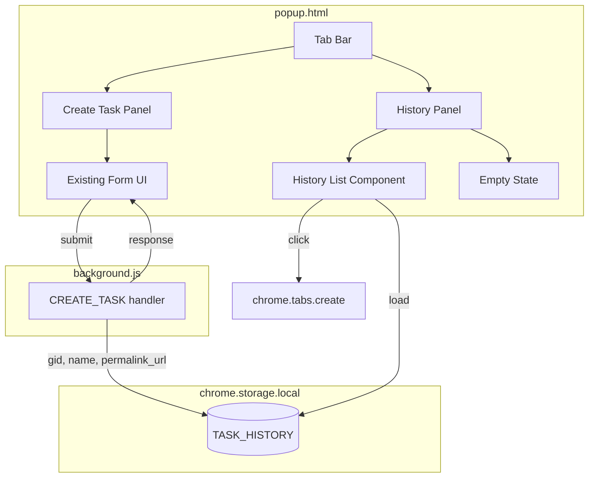
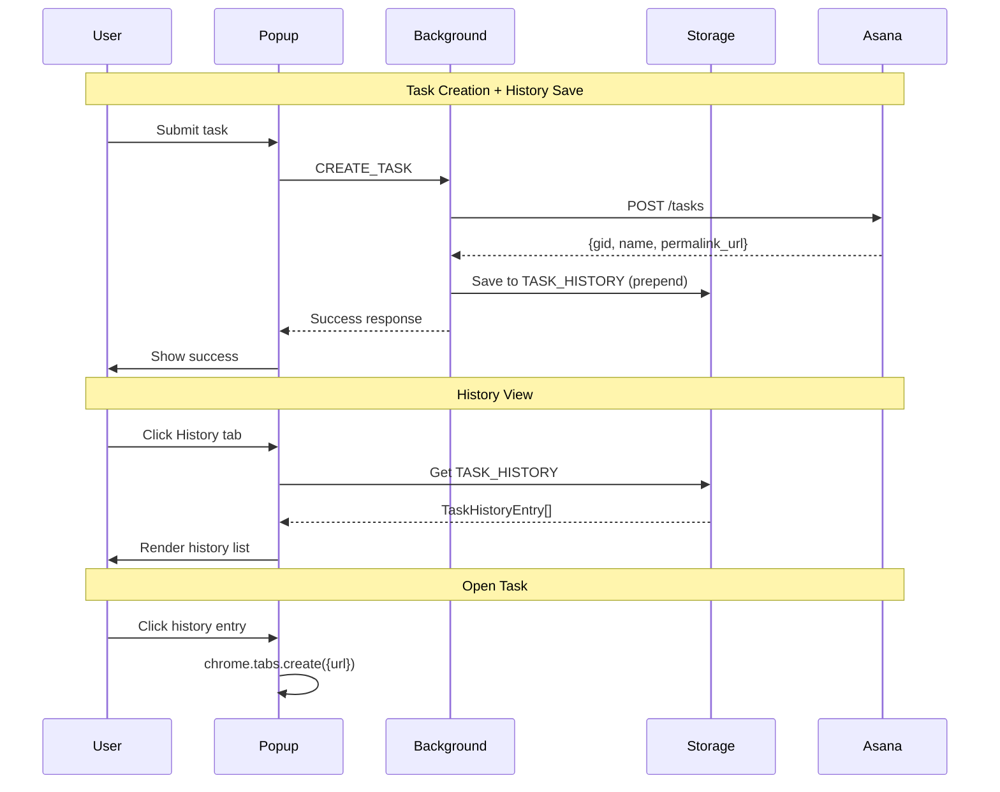

# Design: Task History with Tabbed UI

## Overview

Add tabbed interface wrapping existing popup content. Tab 1 ("Create Task") contains existing form. Tab 2 ("History") shows recently created tasks stored in `chrome.storage.local`. Tasks saved on successful creation; clicking opens Asana in new tab.

## Architecture



## Components

### Tab Bar

**Purpose**: Switch between Create Task and History views

**Structure**:
```html
<nav class="tab-bar" role="tablist">
  <button class="tab-button active" data-tab="create" role="tab">Create Task</button>
  <button class="tab-button" data-tab="history" role="tab">History</button>
</nav>
```

**Behavior**:
- Active tab gets `.active` class
- Toggles `.hidden` on tab panels
- No re-render, pure CSS show/hide

### History List

**Purpose**: Display saved tasks, enable navigation to Asana

**Structure**:
```html
<ul class="history-list">
  <li class="history-item" data-gid="123" data-url="https://...">
    <span class="history-name">Task name here</span>
    <span class="history-time">2h ago</span>
  </li>
</ul>
```

**Behavior**:
- Event delegation on `<ul>` for click handling
- `chrome.tabs.create({ url })` on click
- Rendered from `TaskHistoryEntry[]` array

### Empty State

**Purpose**: Show helpful message when history is empty

**Structure**:
```html
<div class="history-empty">
  <p>No tasks created yet.</p>
  <p class="history-empty-hint">Tasks you create will appear here.</p>
</div>
```

## Data Model

### TaskHistoryEntry

```typescript
// src/shared/types.ts
export interface TaskHistoryEntry {
  gid: string;           // Asana task GID
  name: string;          // Task name at creation time
  permalink_url: string; // Asana deep link
  createdAt: number;     // Unix timestamp (ms)
}
```

**Storage format**: `TaskHistoryEntry[]` stored under `STORAGE_KEYS.TASK_HISTORY`

**Constraints**:
- Max 50 entries (LIFO)
- Estimated size: ~500 bytes/entry max = 25KB for full history

### STORAGE_KEYS Addition

```typescript
// src/shared/constants.ts
export enum STORAGE_KEYS {
  // ... existing keys
  TASK_HISTORY = 'task_history',
}
```

## Data Flow



## Technical Decisions

| Decision | Options | Choice | Rationale |
|----------|---------|--------|-----------|
| Tab implementation | CSS-only vs JS-managed | JS-managed | Need to load history data on tab switch |
| History save location | Popup vs Background | Background | Centralized, survives popup close mid-save |
| Time formatting | Library vs custom | Custom | NFR: no new dependencies, simple logic |
| Click handler | Per-item vs delegation | Delegation | Performance with 50 items |
| Storage key naming | Flat vs namespaced | Flat | Matches existing STORAGE_KEYS pattern |

## File Structure

| File | Action | Purpose |
|------|--------|---------|
| `src/shared/types.ts` | Modify | Add `TaskHistoryEntry` interface |
| `src/shared/constants.ts` | Modify | Add `TASK_HISTORY` to STORAGE_KEYS |
| `src/popup/popup.html` | Modify | Add tab bar, history panel structure |
| `src/popup/popup.css` | Modify | Add tab bar, history list styles |
| `src/popup/popup.ts` | Modify | Add tab switching, history rendering, save logic |
| `src/popup/history.ts` | Create | History-specific logic (storage, formatting) |

## Interface Definitions

### history.ts Module

```typescript
// src/popup/history.ts

/**
 * Load task history from storage
 */
export async function loadHistory(): Promise<TaskHistoryEntry[]>;

/**
 * Save a task to history (prepend, cap at 50)
 */
export async function saveToHistory(task: {
  gid: string;
  name: string;
  permalink_url: string;
}): Promise<void>;

/**
 * Format timestamp to relative time string
 * @returns "Just now", "2h ago", "Yesterday", "Jan 15"
 */
export function formatRelativeTime(timestamp: number): string;

/**
 * Render history list to container
 */
export function renderHistoryList(
  container: HTMLElement,
  entries: TaskHistoryEntry[]
): void;
```

### Tab Switching

```typescript
// popup.ts additions

interface TabState {
  activeTab: 'create' | 'history';
  historyLoaded: boolean;
}

function switchTab(tab: 'create' | 'history'): void;
function handleHistoryItemClick(event: MouseEvent): void;
```

## HTML Structure Changes

```html
<!-- Insert after header, before auth-section -->
<nav class="tab-bar" role="tablist">
  <button class="tab-button active" data-tab="create" role="tab"
          aria-selected="true" aria-controls="panel-create">
    Create Task
  </button>
  <button class="tab-button" data-tab="history" role="tab"
          aria-selected="false" aria-controls="panel-history">
    History
  </button>
</nav>

<!-- Wrap existing content -->
<div id="panel-create" class="tab-panel" role="tabpanel">
  <!-- auth-section, loading-section, error-message, task-form, success-section -->
</div>

<!-- New history panel -->
<div id="panel-history" class="tab-panel hidden" role="tabpanel">
  <div id="history-empty" class="history-empty hidden">
    <p>No tasks created yet.</p>
    <p class="history-empty-hint">Tasks you create will appear here.</p>
  </div>
  <ul id="history-list" class="history-list"></ul>
</div>
```

## CSS Additions

```css
/* Tab Bar */
.tab-bar {
  display: flex;
  border-bottom: 1px solid var(--color-border);
  margin-bottom: var(--spacing-sm);
}

.tab-button {
  flex: 1;
  padding: var(--spacing-sm) var(--spacing-md);
  border: none;
  background: transparent;
  color: var(--color-text-muted);
  font-size: var(--font-size-sm);
  font-weight: 500;
  cursor: pointer;
  border-bottom: 2px solid transparent;
  transition: color var(--transition-fast), border-color var(--transition-fast);
}

.tab-button:hover {
  color: var(--color-text);
}

.tab-button.active {
  color: var(--color-primary);
  border-bottom-color: var(--color-primary);
}

/* History List */
.history-list {
  list-style: none;
  max-height: 400px;
  overflow-y: auto;
}

.history-item {
  display: flex;
  justify-content: space-between;
  align-items: center;
  padding: var(--spacing-sm) var(--spacing-xs);
  border-radius: var(--radius-sm);
  cursor: pointer;
  transition: background-color var(--transition-fast);
}

.history-item:hover {
  background-color: var(--color-background-hover);
}

.history-name {
  flex: 1;
  white-space: nowrap;
  overflow: hidden;
  text-overflow: ellipsis;
  margin-right: var(--spacing-sm);
  color: var(--color-primary);
  font-size: var(--font-size-sm);
}

.history-time {
  flex-shrink: 0;
  color: var(--color-text-muted);
  font-size: var(--font-size-xs);
}

/* Empty State */
.history-empty {
  text-align: center;
  padding: var(--spacing-xl);
  color: var(--color-text-muted);
}

.history-empty-hint {
  font-size: var(--font-size-sm);
  margin-top: var(--spacing-sm);
}
```

## Error Handling

| Error Scenario | Handling Strategy | User Impact |
|----------------|-------------------|-------------|
| Storage read fails | Log error, show empty list | "Unable to load history" message |
| Storage write fails | Log error, don't block task creation | Task created but not in history |
| Invalid history data | Filter out invalid entries | Graceful degradation |
| Tab switch during save | Save completes async | No impact |

## Edge Cases

- **Task name very long**: CSS truncation with ellipsis
- **Rapid task creation**: Each save reads-modifies-writes; last wins
- **History at capacity**: Oldest entry removed on new save
- **Storage quota exceeded**: Extremely unlikely (25KB << 10MB), log warning
- **Browser restart**: History persists via chrome.storage.local
- **Extension update**: History preserved per Chrome behavior

## Test Strategy

### Unit Tests

| Function | Test Cases |
|----------|------------|
| `formatRelativeTime` | Now, minutes, hours, yesterday, older dates |
| `saveToHistory` | Empty history, under cap, at cap (50th entry) |
| `loadHistory` | Empty, with data, invalid data filtering |

### Integration Tests

| Scenario | Verification |
|----------|-------------|
| Create task | History entry added with correct data |
| Switch tabs | History loads, create form persists state |
| Click history item | New tab opens with correct URL |

### Manual Testing Checklist

- [ ] Tab switching works
- [ ] History loads on tab switch
- [ ] Task saved to history on creation
- [ ] Click opens Asana in new tab
- [ ] Empty state shows when no history
- [ ] Long task names truncate properly
- [ ] Time display updates correctly
- [ ] Keyboard navigation works (arrow keys, Enter)

## Performance Considerations

- Load history lazily on first History tab click
- DOM rendering: single innerHTML write for list
- Event delegation avoids 50 individual listeners
- No virtual scrolling needed (50 items max)

## Security Considerations

- No user input in history (all from API response)
- permalink_url comes from trusted Asana API
- No XSS risk in task names (textContent, not innerHTML for names)

## Accessibility

- ARIA roles: `tablist`, `tab`, `tabpanel`
- `aria-selected` state on tabs
- `aria-controls` linking tabs to panels
- Keyboard: Tab to switch, Enter to select history item
- Focus management on tab switch

## Existing Patterns to Follow

| Pattern | Location | Apply To |
|---------|----------|----------|
| `get<T>`/`set<T>` storage | `shared/storage.ts` | History load/save |
| `STORAGE_KEYS` enum | `shared/constants.ts` | Add TASK_HISTORY |
| `showSection()` toggle | `popup.ts:196` | Tab panel switching |
| `.hidden` class | `popup.css:91` | Tab panels |
| Event delegation | `popup.ts:1265` | History item clicks |
| CSS variables | `popup.css:6-54` | All new styles |

## Implementation Steps

1. Add `TaskHistoryEntry` type to `src/shared/types.ts`
2. Add `TASK_HISTORY` to `STORAGE_KEYS` enum
3. Create `src/popup/history.ts` with storage and formatting functions
4. Update `popup.html` with tab bar and history panel structure
5. Add tab bar and history list styles to `popup.css`
6. Add tab switching logic to `popup.ts`
7. Integrate history save into success handler
8. Add history list rendering with click handler
9. Add empty state toggle logic
10. Add keyboard accessibility (arrow keys for tabs)
11. Write unit tests for history.ts functions
12. Manual testing pass
