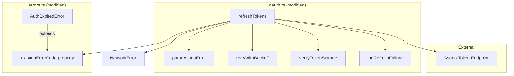
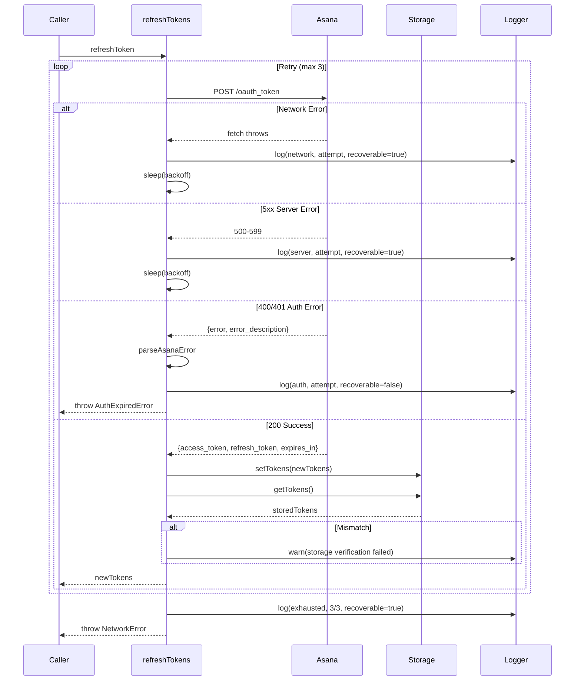

# Design: Refresh Token Error Handling

## Overview

Enhance `refreshTokens()` in oauth.ts with Asana error parsing, exponential backoff retry (1s, 2s, 4s), and diagnostic logging. Mirrors existing retry pattern in `asana-api.ts` for consistency.

## Design Inputs

| Question | Decision |
|----------|----------|
| Architecture style | Extend existing (modify oauth.ts) |
| Technology constraints | None - use whatever works |
| Apply retry to initial token exchange? | No - only refresh (per requirements) |
| Storage verification failure behavior | Log warning, don't block |
| Max retry time | 10 seconds total |

## Architecture



## Components

### 1. parseAsanaError

**Purpose**: Extract structured error from Asana 400/401 response

**Interface**:
```typescript
interface AsanaOAuthError {
  error: 'invalid_grant' | 'invalid_client' | 'unauthorized_client' | string;
  error_description?: string;
}

function parseAsanaError(response: Response): Promise<AsanaOAuthError | null>
```

**Responsibilities**:
- Parse JSON response body safely
- Extract `error` and `error_description` fields
- Return null on parse failure (non-JSON response)

### 2. retryWithBackoff (inlined in refreshTokens)

**Purpose**: Retry transient failures with exponential backoff

**Configuration**:
| Setting | Value |
|---------|-------|
| MAX_RETRIES | 3 |
| BASE_DELAY_MS | 1000 |
| Delays | 1s, 2s, 4s |
| Total max time | 7s (within 10s NFR) |

**Retryable conditions**:
- Network errors (fetch throws)
- Server errors (5xx)

**Non-retryable conditions**:
- `invalid_grant` (token revoked)
- `invalid_client` (config error)
- `unauthorized_client` (scope error)
- 4xx except 429

### 3. logRefreshFailure

**Purpose**: Diagnostic logging for developers

**Interface**:
```typescript
interface RefreshFailureContext {
  timestamp: number;
  attempt: number;
  totalAttempts: number;
  httpStatus?: number;
  asanaError?: string;
  asanaDescription?: string;
  isRecoverable: boolean;
  errorType: 'network' | 'auth' | 'config' | 'unknown';
}

function logRefreshFailure(context: RefreshFailureContext): void
```

**Log format**:
```
[OAuth] Token refresh failed (attempt 2/3)
  timestamp: 2026-01-22T10:30:00.000Z
  status: 400
  error: invalid_grant
  description: The refresh token is invalid or has been revoked
  recoverable: false
  type: auth
```

### 4. verifyTokenStorage

**Purpose**: Confirm tokens persisted correctly after save

**Interface**:
```typescript
async function verifyTokenStorage(expected: OAuthTokens): Promise<boolean>
```

**Behavior**:
- Read tokens after write
- Compare accessToken, refreshToken, expiresAt
- Return true if match
- Log warning if mismatch
- Does NOT throw (non-blocking)

### 5. AuthExpiredError Enhancement

**Current**:
```typescript
class AuthExpiredError extends ExtensionError {
  readonly code = 'AUTH_EXPIRED';
  readonly userMessage = 'Your session has expired. Please log in again.';
}
```

**Enhanced**:
```typescript
class AuthExpiredError extends ExtensionError {
  readonly code = 'AUTH_EXPIRED';
  readonly userMessage: string;
  readonly asanaErrorCode?: string;

  constructor(
    message?: string,
    asanaErrorCode?: string,
    cause?: unknown
  ) {
    super(message ?? 'Session expired', cause);
    this.asanaErrorCode = asanaErrorCode;
    this.userMessage = getMessageForErrorCode(asanaErrorCode);
  }
}

function getMessageForErrorCode(code?: string): string {
  switch (code) {
    case 'invalid_grant':
      return 'Your session has expired. Please log in again.';
    case 'invalid_client':
      return 'Configuration error. Please contact support.';
    case 'unauthorized_client':
      return 'Authorization error. Please contact support.';
    default:
      return 'Authentication failed. Please try again.';
  }
}
```

## Data Flow



## Technical Decisions

| Decision | Options | Choice | Rationale |
|----------|---------|--------|-----------|
| Retry location | New utility vs inline | Inline in refreshTokens | Matches asana-api.ts pattern; single use case |
| Error parsing | Generic vs Asana-specific types | Asana-specific | Type safety; known error codes |
| Storage verification | Blocking vs warning | Warning only | NFR-3 zero breaking changes; can't fail silently |
| Logging level | Always vs debug flag | Always console.error for failures | Devs need visibility; errors are rare |
| Backoff formula | Linear vs exponential | Exponential (2^n) | Industry standard; matches asana-api.ts |
| Max retries | 2 vs 3 vs 5 | 3 | 7s total fits 10s NFR; matches asana-api.ts |

## File Structure

| File | Action | Purpose |
|------|--------|---------|
| `src/background/oauth.ts` | Modify | Add retry loop, error parsing, logging, verification |
| `src/shared/errors.ts` | Modify | Add `asanaErrorCode` property to AuthExpiredError |
| `src/background/__tests__/oauth.test.ts` | Modify | Add tests for new behaviors |

## Error Handling

| Error Scenario | Detection | Handling | User Impact |
|----------------|-----------|----------|-------------|
| Network timeout | fetch throws | Retry 3x with backoff | May see brief delay |
| Asana 5xx | status >= 500 | Retry 3x with backoff | May see brief delay |
| invalid_grant | 400 + parsed body | Throw AuthExpiredError immediately | "Session expired" prompt |
| invalid_client | 400 + parsed body | Throw AuthExpiredError immediately | "Configuration error" message |
| unauthorized_client | 400 + parsed body | Throw AuthExpiredError immediately | "Authorization error" message |
| Storage mismatch | read-after-write compare | Log warning, continue | None (silent) |
| Retries exhausted | attempt > MAX | Throw NetworkError | "Connection failed" message |

## Edge Cases

- **Non-JSON error response**: parseAsanaError returns null; treat as unknown 4xx
- **Empty error field**: Treat as unknown 4xx; log raw status
- **Storage read fails after write**: Log warning; don't throw (tokens may still work)
- **Offline detected mid-retry**: Throw NetworkOfflineError immediately (no more retries)
- **Response body already consumed**: Clone response before parsing error

## Test Strategy

### Unit Tests (oauth.test.ts)

| Test Case | Setup | Expected |
|-----------|-------|----------|
| Parses invalid_grant error | Mock 400 + JSON body | Throws AuthExpiredError with asanaErrorCode |
| Parses invalid_client error | Mock 400 + JSON body | Throws AuthExpiredError with "Configuration error" |
| Retries on network error | Mock fetch throw, then success | Returns tokens after retry |
| Retries on 5xx | Mock 503, then 200 | Returns tokens after retry |
| No retry on invalid_grant | Mock 400 invalid_grant | Throws immediately (no retry) |
| Respects max retries | Mock fetch throws 4x | Throws NetworkError after 3 attempts |
| Exponential backoff timing | Mock fetch throws, track delays | Delays are 1s, 2s, 4s |
| Verifies storage after save | Mock setTokens, getTokens | getTokens called after setTokens |
| Logs warning on storage mismatch | Mock getTokens returns different | console.warn called |
| Logs failure with context | Mock 400 | console.error contains timestamp, status, error |

### Coverage Target

| Function | Target |
|----------|--------|
| refreshTokens | 95%+ |
| parseAsanaError | 100% |
| verifyTokenStorage | 100% |
| logRefreshFailure | 90% |

## Performance Considerations

- **Retry latency**: Max 7s (1+2+4s delays) < 10s NFR target
- **Storage verification**: Single read operation; negligible overhead
- **Logging**: Only on errors; no performance impact in happy path

## Security Considerations

- **Never log tokens**: Access/refresh tokens must not appear in logs
- **Log error codes only**: Safe to log `invalid_grant`, status codes, timestamps
- **No token in error messages**: User-facing messages generic

## Existing Patterns to Follow

Based on codebase analysis:

1. **Retry pattern from asana-api.ts** (lines 53-75, 115-144):
   ```typescript
   const MAX_RETRIES = 3;
   const BASE_DELAY_MS = 1000;

   function calculateBackoffDelay(attempt: number): number {
     return BASE_DELAY_MS * Math.pow(2, attempt);
   }

   for (let attempt = 0; attempt <= MAX_RETRIES; attempt++) {
     // ... try fetch ...
     if (shouldRetry) {
       await sleep(calculateBackoffDelay(attempt));
       continue;
     }
   }
   ```

2. **Error wrapping from errors.ts** (wrapFetchError, wrapResponseError)

3. **Logging format**: `[Module] Message` (e.g., `[OAuth] Token refresh failed`)

4. **Error class pattern** (ExtensionError base with code, userMessage)

## Implementation Steps

1. Add `asanaErrorCode` property to AuthExpiredError in errors.ts
2. Add `parseAsanaError()` helper function in oauth.ts
3. Add `logRefreshFailure()` logging function in oauth.ts
4. Add `verifyTokenStorage()` verification function in oauth.ts
5. Refactor `refreshTokens()` with retry loop and new helpers
6. Update AuthExpiredError constructor call with Asana error code
7. Add unit tests for error parsing scenarios
8. Add unit tests for retry behavior
9. Add unit tests for storage verification
10. Run test suite and verify 90%+ coverage
