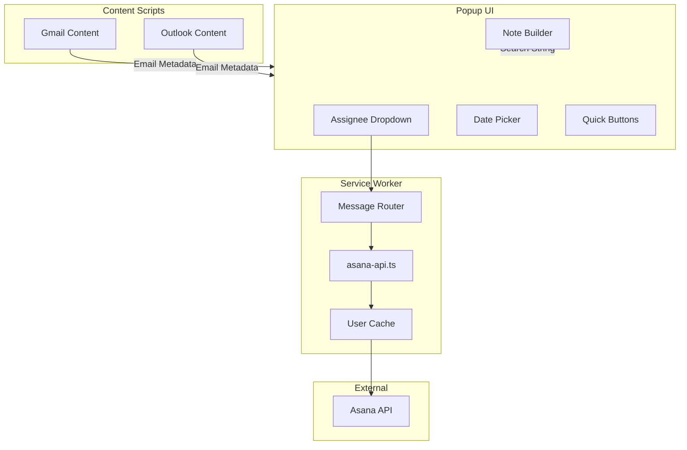
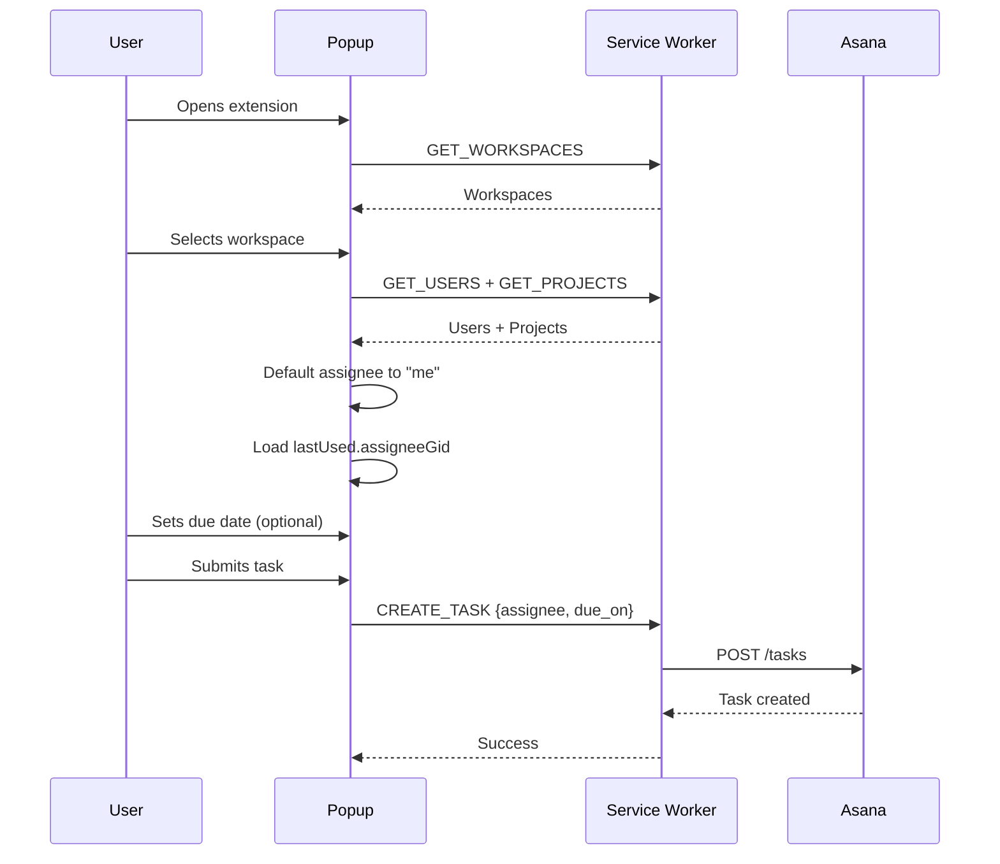
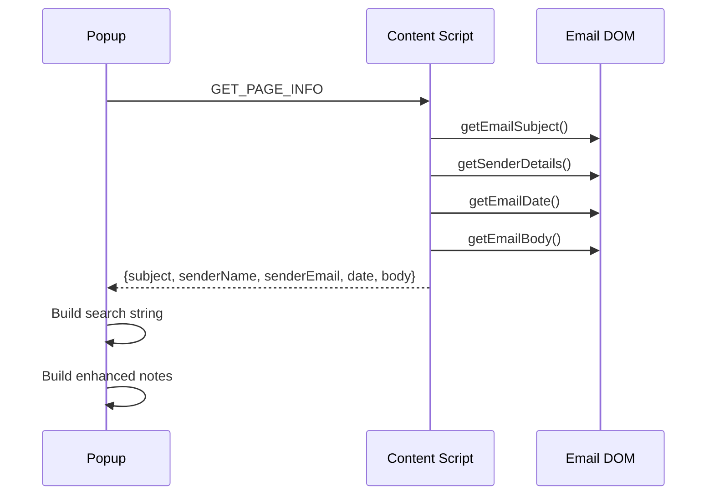

# Design: Task Creation Fields Enhancement

## Overview

Extends task creation with assignee dropdown (defaulting to "me") and due date picker with quick-pick buttons. Enhances email task notes with full sender metadata and client-specific search strings for Gmail/Outlook.

## Design Inputs

| Question | Answer |
|----------|--------|
| Architecture style | Extend existing patterns (popup.ts, asana-api.ts, content scripts) |
| Technology constraints | None specified |

## Architecture



## Components

### 1. AsanaUser Type & API

**Purpose**: Fetch workspace users for assignee dropdown

**Location**: `src/shared/types.ts`, `src/background/asana-api.ts`

**Interface**:
```typescript
// types.ts
export interface AsanaUser {
  gid: string;
  name: string;
  email: string;
}

// Extend CreateTaskPayload
export interface CreateTaskPayload {
  name: string;
  notes?: string;
  projectGid: string;
  sectionGid?: string;
  tagGids?: string[];
  workspaceGid: string;
  assignee?: string;      // User GID or null
  due_on?: string;        // YYYY-MM-DD
  due_at?: string;        // ISO 8601 UTC
}

// Extend ExtensionMessage
export type ExtensionMessage =
  | { type: 'GET_USERS'; workspaceGid: string }
  // ... existing types
```

### 2. Users API Function

**Purpose**: Fetch users from Asana API

**Location**: `src/background/asana-api.ts`

**Interface**:
```typescript
export async function getUsers(workspaceGid: string): Promise<AsanaUser[]>;
export async function getCurrentUser(): Promise<AsanaUser>;
```

### 3. Email Metadata Extraction

**Purpose**: Extract sender name, email, and date from email DOM

**Location**: `src/content/gmail-content.ts`, `src/content/outlook-content.ts`

**Interface**:
```typescript
// Shared type for structured sender info
export interface EmailSenderInfo {
  name?: string;
  email?: string;
}

// New functions in content scripts
export function getEmailDate(): string | undefined;  // Returns ISO date
export function getSenderDetails(): EmailSenderInfo;
```

### 4. Email Search String Builder

**Purpose**: Generate email client search strings

**Location**: `src/popup/email-search.ts` (new file)

**Interface**:
```typescript
export interface EmailSearchParams {
  senderEmail?: string;
  subject?: string;
  date?: string;  // ISO date
}

export function buildGmailSearchString(params: EmailSearchParams): string;
export function buildOutlookSearchString(params: EmailSearchParams): string;
```

### 5. LastUsedSelections Extension

**Purpose**: Persist assignee selection across sessions

**Location**: `src/shared/types.ts`

**Interface**:
```typescript
export interface LastUsedSelections {
  workspaceGid: string;
  projectGid: string;
  sectionGid?: string;
  assigneeGid?: string;  // NEW: persisted assignee
}
```

## Data Flow

### Task Creation with Assignee/Due Date



### Email Metadata Extraction



## Technical Decisions

| Decision | Options Considered | Choice | Rationale |
|----------|-------------------|--------|-----------|
| User fetch timing | On popup open / On workspace change | Workspace change | Matches existing projects/tags pattern |
| Assignee default | Blank / "me" / Last used | "me" then last used | User requested default to "me" |
| Due date storage | Persist / Don't persist | Don't persist | User only requested assignee persistence |
| Date picker | Native HTML / Custom | Native HTML `<input type="date">` | Simpler, consistent UX |
| Time picker | Combined / Separate | Separate checkbox + time | Users rarely need time |
| Search string location | Separate field / In notes | In notes | Simpler, requested by user |
| User cache TTL | 5min / 15min / 30min | 5 minutes | Matches existing cache pattern |
| Email date parsing | Content script / Popup | Content script | Access to DOM, consistent pattern |

## File Structure

| File | Action | Purpose |
|------|--------|---------|
| `src/shared/types.ts` | Modify | Add AsanaUser, extend CreateTaskPayload, ExtensionMessage, LastUsedSelections |
| `src/background/asana-api.ts` | Modify | Add getUsers(), getCurrentUser() |
| `src/background/service-worker.ts` | Modify | Add GET_USERS handler, extend CACHE_KEYS |
| `src/content/gmail-content.ts` | Modify | Add getEmailDate(), getSenderDetails() |
| `src/content/outlook-content.ts` | Modify | Add getEmailDate(), getSenderDetails() |
| `src/popup/popup.ts` | Modify | Add assignee/date UI, enhanced notes |
| `src/popup/popup.html` | Modify | Add assignee dropdown, date picker, quick buttons |
| `src/popup/popup.css` | Modify | Styles for new fields |
| `src/popup/email-search.ts` | Create | Search string builders |
| `src/popup/__tests__/email-search.test.ts` | Create | Unit tests for search builders |
| `src/content/__tests__/gmail-content.test.ts` | Modify | Tests for getEmailDate(), getSenderDetails() |
| `src/content/__tests__/outlook-content.test.ts` | Modify | Tests for getEmailDate(), getSenderDetails() |
| `src/background/__tests__/asana-api.test.ts` | Modify | Tests for getUsers() |

## Detailed Interface Definitions

### Email Info Extensions

```typescript
// Gmail
export interface GmailEmailInfo {
  messageId: string | null;
  userId: string;
  accountEmail: string | null;
  permanentUrl: string;
  isConfidentialMode: boolean;
  subject?: string;
  emailBody?: string;
  emailSender?: string;         // Existing (for backward compat)
  senderName?: string;          // NEW
  senderEmail?: string;         // NEW
  emailDate?: string;           // NEW: ISO date string
  warnings?: Warning[];
}

// Outlook
export interface OutlookEmailInfo {
  itemId: string | null;
  variant: OutlookVariant;
  permanentUrl: string;
  subject?: string;
  emailBody?: string;
  emailSender?: string;         // Existing (for backward compat)
  senderName?: string;          // NEW
  senderEmail?: string;         // NEW
  emailDate?: string;           // NEW: ISO date string
}
```

### Popup State Extension

```typescript
interface PopupLocalState {
  // ... existing fields

  // New fields
  users: AsanaUser[];
  currentUserGid: string | null;
  selectedAssigneeGid: string | null;  // null = unassigned
  dueDate: string | null;              // YYYY-MM-DD
  dueTime: string | null;              // HH:mm (24h format)

  // Enhanced email metadata
  senderName?: string;
  senderEmail?: string;
  emailDate?: string;
}
```

## Error Handling

| Error Scenario | Handling Strategy | User Impact |
|----------------|-------------------|-------------|
| Users API fails | Show error, disable assignee dropdown, allow unassigned task creation | Warning message, can still create task |
| No users in workspace | Show empty dropdown with "No users found" | User selects unassigned |
| Current user fetch fails | Default to first user in list or unassigned | Graceful degradation |
| Email date extraction fails | Omit date from notes, skip search string date filter | Partial metadata in notes |
| Sender extraction fails | Fall back to existing emailSender field | Partial metadata |
| Invalid date format | Clear date field, show validation error | User re-enters date |
| Large workspace (1000+ users) | Load all users, rely on browser select filtering | Slower initial load |

## Edge Cases

- **Workspace with no users**: Show "No users available" message, default to unassigned
- **User leaves workspace**: Task creation fails if assigned to removed user - handle API error
- **Email without date**: Omit date from notes and search string
- **Email without sender**: Omit sender from search string, show partial notes
- **Date in past**: Allow it (tasks can have past due dates)
- **Date picker browser support**: Native `<input type="date">` has wide support, fallback not needed
- **Multi-account Gmail**: Already handled via userId in URL, date extraction unaffected
- **Confidential mode email**: Date may not be extractable, graceful degradation
- **Reading pane vs full view**: Different DOM structures - multiple selector fallbacks

## Test Strategy

### Unit Tests

**email-search.ts**:
- buildGmailSearchString with all params
- buildGmailSearchString with missing params
- buildOutlookSearchString with all params
- buildOutlookSearchString with missing params
- Date format conversion (ISO to Gmail/Outlook format)

**asana-api.ts**:
- getUsers returns mapped users
- getUsers handles empty workspace
- getCurrentUser returns current user
- createTask includes assignee/due_on/due_at

**gmail-content.ts**:
- getEmailDate extracts date from DOM
- getSenderDetails extracts name and email separately
- Fallback selectors when primary fails

**outlook-content.ts**:
- getEmailDate extracts date from DOM
- getSenderDetails parses "Name<email>" format
- Fallback selectors when primary fails

### Integration Tests

**service-worker**:
- GET_USERS message handling
- User caching behavior
- Cache invalidation on workspace change

**popup**:
- Assignee dropdown population
- Assignee default to "me"
- Assignee persistence across sessions
- Due date quick-pick buttons
- Note generation with email metadata
- Search string in notes for Gmail/Outlook

### E2E Tests (if applicable)

- Create task with assignee
- Create task with due date
- Create task from Gmail with search string in notes
- Create task from Outlook with search string in notes

## Performance Considerations

- **User caching**: 5-minute TTL matches existing cache pattern
- **Parallel loading**: Load users and projects simultaneously on workspace change
- **Lazy date extraction**: Only extract email date when creating email tasks
- **DOM query optimization**: Use specific selectors, avoid querySelectorAll where possible

## Security Considerations

- **User GIDs only**: Never expose user emails to external services (stays in notes)
- **No PII in cache keys**: Use GIDs not emails for cache keys
- **Search strings**: Only include data already visible in email, no new data exposure

## Existing Patterns to Follow

Based on codebase analysis:

1. **Message handling**: Use `ExtensionMessage` union type, add `GET_USERS` variant
2. **API functions**: Follow `getProjects(workspaceGid)` pattern for `getUsers(workspaceGid)`
3. **Caching**: Use `getOrFetch()` with `CACHE_KEYS.USERS(workspaceGid)` pattern
4. **Type definitions**: Add types to `src/shared/types.ts`
5. **Dropdown population**: Follow `populateProjectDropdown()` pattern
6. **State management**: Extend `PopupLocalState` interface
7. **Note generation**: Use `noteParts.push()` then `join('\n\n')` pattern
8. **Content script exports**: Export individual functions, no default exports
9. **Test structure**: Use `describe/it` with vitest, mock chrome APIs

## Implementation Steps

1. **Types & API** (FR-1, FR-2, FR-3, FR-4, FR-4b, FR-16)
   - Add `AsanaUser` type
   - Extend `CreateTaskPayload` with assignee, due_on, due_at
   - Add `GET_USERS` to `ExtensionMessage`
   - Implement `getUsers()` and `getCurrentUser()` in asana-api.ts
   - Add handler in service-worker.ts

2. **Content Scripts** (FR-7, FR-8, FR-9, FR-10)
   - Add `getEmailDate()` to Gmail content script
   - Add `getEmailDate()` to Outlook content script
   - Refactor `getEmailSender()` to `getSenderDetails()` returning `{name, email}`
   - Maintain backward compatibility with existing `emailSender` field

3. **Email Search Strings** (FR-13, FR-14)
   - Create `src/popup/email-search.ts`
   - Implement `buildGmailSearchString()`
   - Implement `buildOutlookSearchString()`
   - Add unit tests

4. **Popup UI - Assignee** (FR-5, FR-11, FR-11b, FR-12)
   - Add assignee dropdown to popup.html
   - Add users loading in popup.ts
   - Implement "me" default using getCurrentUser()
   - Add user caching
   - Extend LastUsedSelections with assigneeGid
   - Implement assignee persistence

5. **Popup UI - Due Date** (FR-6, FR-6b)
   - Add date picker to popup.html
   - Add "Today" and "Tomorrow" quick-pick buttons
   - Add optional time picker (checkbox + time input)
   - Wire up due_on/due_at in task payload

6. **Enhanced Notes** (FR-15)
   - Update note generation with sender name, email, date, subject, account
   - Add search string to notes for email tasks
   - Format for readability and copy-paste

## Unresolved Questions

1. **Large workspace handling**: Defer pagination/search to P2 or implement now? (Recommend: defer, rely on browser select filtering)
2. **Time zone handling**: Use local timezone for due_at or always UTC? (Recommend: local timezone converted to UTC per Asana spec)
